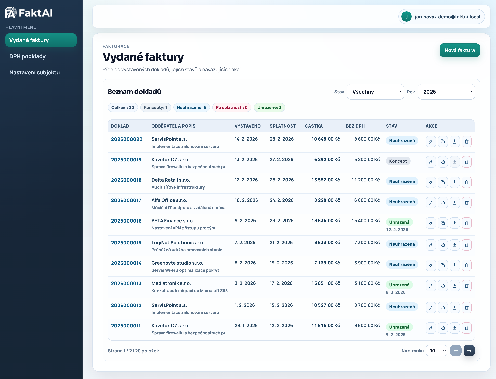

# FaktAI - fakturační systém vytvoření fakt pomocí AI

FaktAI je experiment „AI-first“ vývoje reálné SaaS aplikace pro fakturaci OSVČ.

Repozitář projektu: [github.com/sarsonj/faktai](https://github.com/sarsonj/faktai)

Nasazená verze (použití na vlastní nebezpečí!): [https://faktai.cz](https://faktai.cz)

Cíl projektu:

- postavit funkční fakturační systém od specifikace po nasazení,
- dělat vývoj iterativně přes Change Requesty,
- průběžně měřit, kolik času stojí vývoj s AI vs. ruční postup.

Důležitá poznámka:

- projekt je vytvářený pomocí AI,
- je zdarma a bez záruky.



## Co dnes aplikace umí

- registrace a onboarding subjektu (včetně ARES/adresních lookupů),
- vystavení a správa faktur,
- PDF export faktur včetně QR platby,
- XML exporty pro DPH přiznání a kontrolní hlášení,
- průběžné UX/UI iterace podle uživatelského feedbacku.

## Co plánujeme brzy

- adresář firem,
- výdajové doklady.

## Autor

- Codex 5.3 & Jindřich Šaršon, CTO TappyTaps s.r.o. ([https://tappytaps.com](https://tappytaps.com))

## Vývojový čas (AI)

Zdroj: `doc/vykaz-vyvoje.md` (musí být vždy v sync s tabulkou níže).

| Datum            | Čas (AI, z commitů) | Shrnutí dne                                                                                  |
| ---------------- | --------------------: | --------------------------------------------------------------------------------------------- |
| 2026-02-13       |                6h 39m | Základ projektu: monorepo, auth, onboarding, faktury, PDF, XML a velká vlna UI/UX iterací. |
| 2026-02-14       |                4h 51m | Deploy/branding/landing, další změny v logice faktur, FU XML a regresní opravy.           |
| **Celkem** |     **11h 30m** |                                                                                               |

## Porovnání: ruční vývoj vs AI (orientační)

| Metrika                                   |                       Hodnota | Zdroj                                                               |
| ----------------------------------------- | ----------------------------: | ------------------------------------------------------------------- |
| Ruční odhad realizace (retrospektivně) |                        128 MD | [doc/odhad-realizace-a-naceneni.md](doc/odhad-realizace-a-naceneni.md) |
| AI vývoj (reálně měřeno z commitů)  | 11h 30m (~1.44 MD při 8h/MD) | [doc/vykaz-vyvoje.md](doc/vykaz-vyvoje.md)                             |
| Rozdíl                                   |                     126.56 MD | výpočet z hodnot výše                                           |

Poznámka: srovnání je orientační. Ruční odhad je obchodní retrospektiva, AI čas je technický timesheet z commitů.

## Projektová dokumentace

- Funkční specifikace: [doc/funkcni-specifikace.md](doc/funkcni-specifikace.md)
- Technická specifikace: [doc/tecnicka-specifikace.md](doc/tecnicka-specifikace.md)
- Implementační backlog: [doc/implementacni-backlog.md](doc/implementacni-backlog.md)
- Change requesty: [doc/change-requesty/README.md](doc/change-requesty/README.md)
- Výkaz času vývoje: [doc/vykaz-vyvoje.md](doc/vykaz-vyvoje.md)
- Odhad realizace a nacenění: [doc/odhad-realizace-a-naceneni.md](doc/odhad-realizace-a-naceneni.md)

## Lokální spuštění (rychlý start)

### Varianta 1: Docker Compose

```bash
docker compose up -d --build
```

- Web: `http://localhost:3000`
- API: `http://localhost:4000/api/v1`

### Varianta 2: Dev režim (pnpm workspace)

```bash
pnpm install
pnpm dev
```

## Pravidlo pro aktualizaci času

Když se aktualizuje tabulka času v tomto `README.md`, musí se ve stejném commitu aktualizovat i zdrojový výkaz v `doc/vykaz-vyvoje.md`.
